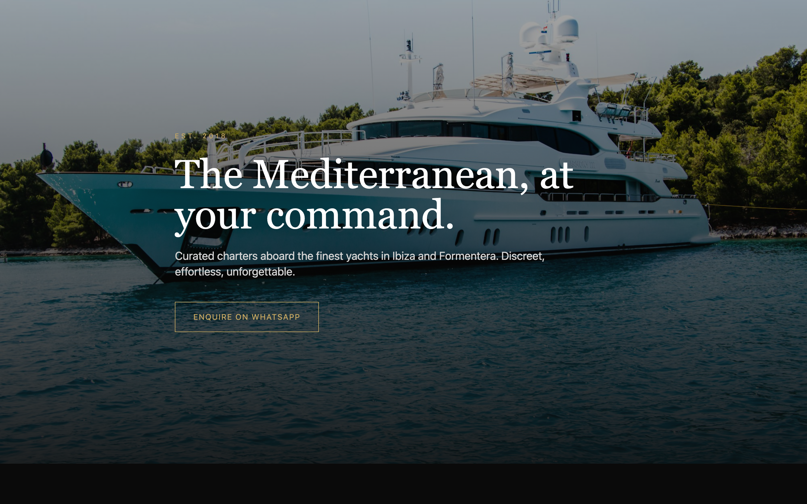

# Next.js Luxury Yacht Template

Premium single-page landing template for luxury yacht charter, hospitality and boutique service brands. JSON-driven content, WhatsApp-first inquiries, mobile-first design. Ready to rebrand in 15 minutes.



## Features

- **Cinematic hero** with full-screen backdrop image, gold accents and serif typography
- **JSON-driven** content in `data/yachts.json` — brand, hero, fleet, features
- **WhatsApp CTAs** on hero, each fleet card and footer
- **Fully static** — deploys to Vercel edge in seconds, zero backend required
- **Mobile-first** responsive layout, keyboard accessible
- **Next.js 14** App Router, TypeScript, Tailwind
- **Brand palette:** dark charcoal + champagne gold, easily swapped in `tailwind.config.ts`

## Quick start

```bash
git clone https://github.com/nazirabas/nextjs-luxury-yacht-template my-charter-site
cd my-charter-site
npm install
npm run dev
```

Edit `data/yachts.json` to change brand, phone, hero image and fleet.

## Rebrand checklist

1. `data/yachts.json` — brand name, tagline, phone (E.164), email, location, hero image URL, yachts array
2. `tailwind.config.ts` — swap `brand.gold` for your accent color
3. `src/app/globals.css` — replace serif font if you have a licensed brand font
4. `public/` — add favicon and OG image

## Live example

Built with the same pattern used in production on [Elite Rentals Ibiza](https://github.com/nazirabas), [Malta](https://github.com/nazirabas) and [Dubai](https://github.com/nazirabas) client sites.

## Pairs well with

- [`nextjs-whatsapp-cta`](https://github.com/nazirabas/nextjs-whatsapp-cta) — drop-in WhatsApp components with UTM tracking
- [`nextjs-seo-starter`](https://github.com/nazirabas/nextjs-seo-starter) — extend with sitemap, robots, JSON-LD

## License

MIT.

---

Built by [Nazir Abbas](https://github.com/nazirabas). Web Developer and SEO Specialist for luxury brands.
